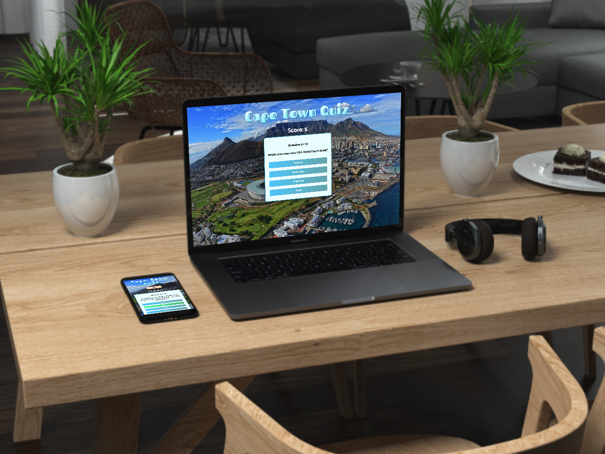

## About
A revamp of a previous 10-question quiz game, this time using React and TypeScript along with an external API for the questions and answers.

### API
- [Open Trivia Database](https://opentdb.com/)

Test your knowledge by taking this quiz live at: [polar-refuge-71762.herokuapp.com](https://polar-refuge-71762.herokuapp.com/)

## Implementation
- Developed & tested locally using Visual Studio Code (CLI GitHub and Heroku deployment)
 - `npm install`
 - `npm start`
 - `access [localhost:3000](http://localhost:3000/)`
- Hosted on a Free Dyno thanks to [Heroku](https://www.heroku.com/)  
  - **Note:** This app is deployed on a free Heroku dyno. Free dynos will sleep after a half hour of inactivity (if they don’t receive any traffic). This causes a delay of a few seconds for the first request upon waking. Subsequent requests will perform normally.
